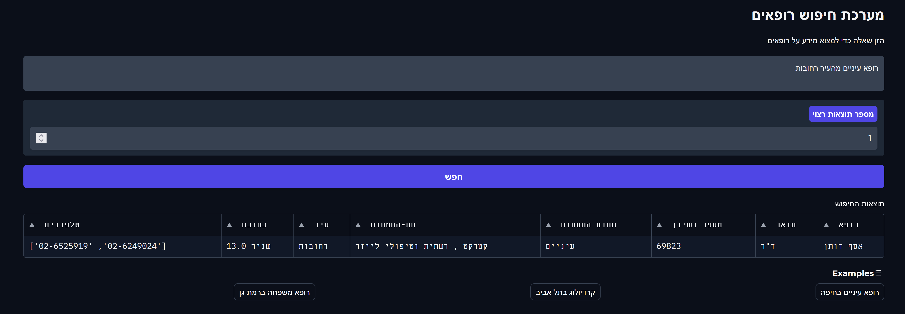

# 🩺 Doctor Search Assistant (Hebrew Version)

**Doctor Search Assistant** is a user-friendly, GUI-based prototype tool designed to help users find relevant doctors based on their specific questions or queries.

---

## ✨ Key Highlights

- **Interactive GUI**: A graphical interface built with Gradio that simplifies the search process. Users can type their questions.
- **Search by Query**: The system interprets the question, processes it using advanced AI models, and returns the results in tabular format.
- **Rich Doctor Profiles**: Each result includes detailed information like the doctor's name, specialization, address, and contact information.
- **Efficient Retrieval**: Powered by FAISS indexing and multilingual embedding models, the tool ensures fast and accurate matches to your query.

## 📈 Use Cases

- Patients looking for specialized doctors.
- Clinics or health organizations needing a quick reference tool.
- Academic or research purposes for medical information systems.
    
---

## 🚀 How It Works

1. **Ask Your Question**: Type a natural language query into the input box.
2. **View Results**: See a clear and comprehensive table of doctors matching your search criteria, complete with all the relevant details.
3. **Interactive Experience**: Adjust the number of results, try different queries, and quickly find what you need.
4. **Default Data Source**: The tool currently uses an Excel spreadsheet (`ServiceBook.xlsx`) as its data source. This spreadsheet includes essential information about doctors, which is preprocessed into a searchable format.
     
---

## ⚙️ Technical Details

- **Gradio**: For building the intuitive GUI interface.
- **Transformers (Hugging Face)**: multilingual-e5-large model for embedding generation with multilingual support.
- **FAISS (Facebook AI)**: For efficient indexing and similarity searches.
- **Pandas**: For handling and displaying structured data.
- **PyTorch**: For running AI models on CUDA-enabled devices.

---

## 🛠️ Getting Started

1. Clone the repository:
   ```bash
   git clone https://github.com/reab5555/doctor-search-assistant.git

   pip install -r requirements.txt

   python run.py
   ```

2. Access the GUI in your browser at http://localhost:7860 or Running on local URL:  http://XXX.X.X.X:7860 or public URL as provided when running.


